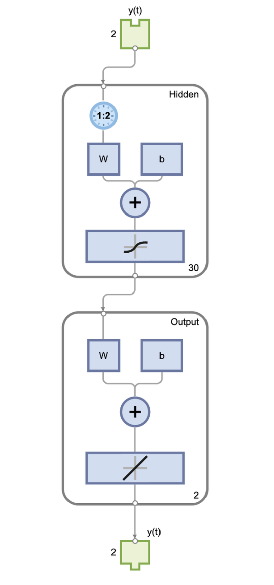
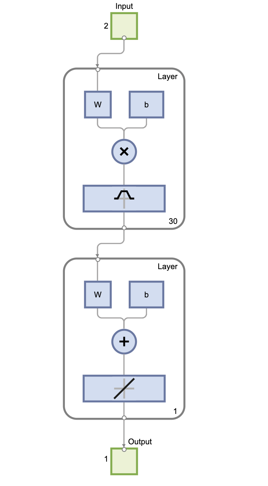
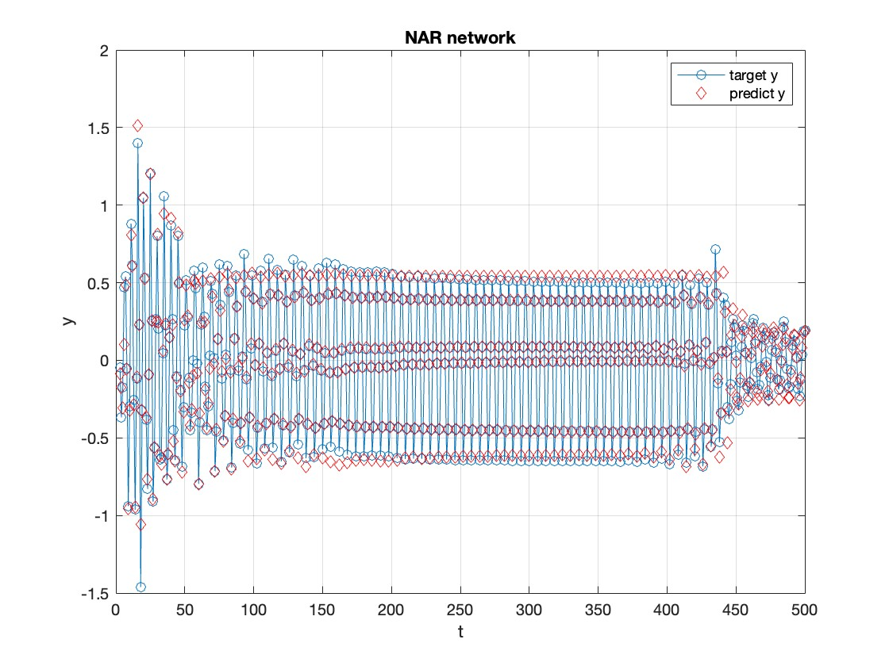
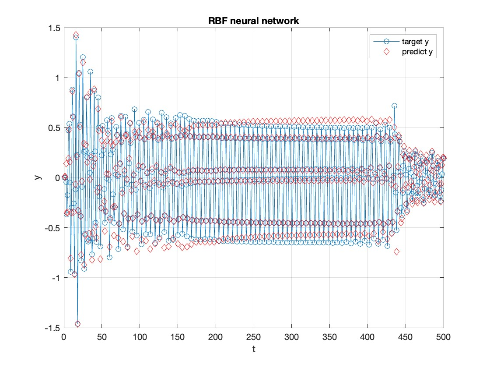
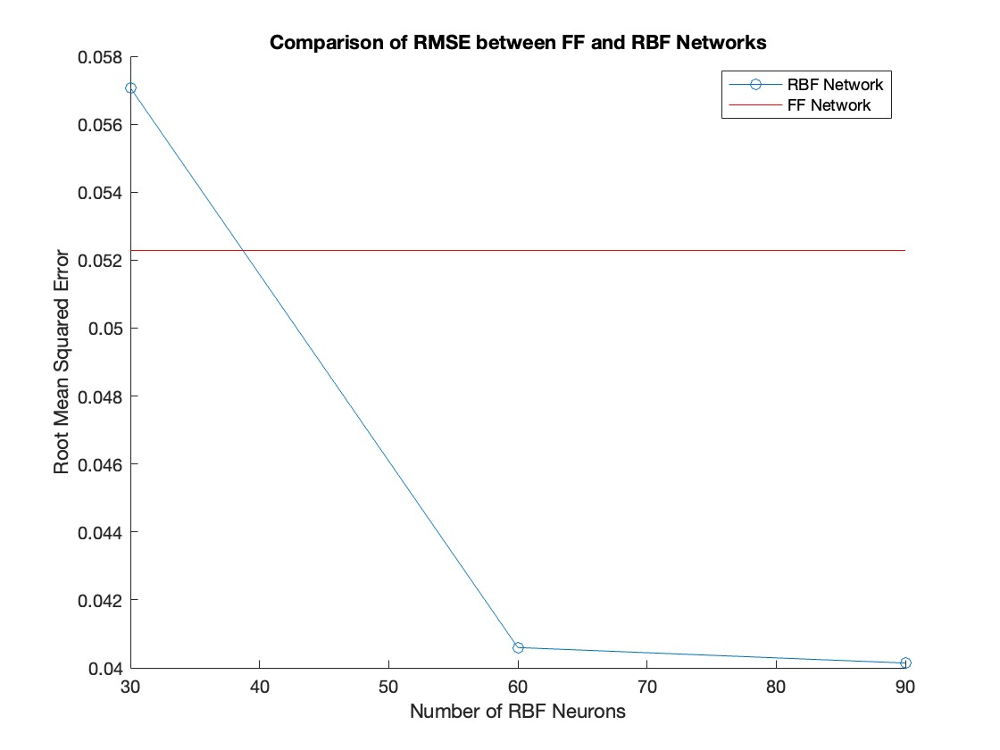

# Comparison of Feedforward NAR and RBF Neural Networks

## Introduction

This code example demonstrates the prediction performance of Feedforward Nonlinear Autoregressive(NAR) and radial basis function (RBF) neural networks using the Neural Network Toolbox in MATLAB.

## Code Description

- First, a dataset `y` is generated using a time series function, and the dataset is converted into a format suitable for neural network processing.
- Next, a feedforward NAR (nonlinear autoregressive) network and three RBF networks are created and trained and tested separately.
- During the training process, the NAR network has training parameters set, including the maximum number of training failures (`max_fail`) and the desired mean squared error (`goal`), while the RBF networks have different numbers of hidden nodes set.
- After training, the mean squared error (MSE) is calculated for the FF network and the three RBF networks.
- Finally, the MSE values of the FF network and the three RBF networks are compared and displayed in a chart.

## File Description

- `compare_FF_RBF.m`: MATLAB code file containing the code for comparing FF and RBF networks.

## Usage

1. This code was coded in Matlab Version of R2022b. Ensure that you have MATLAB installed and have an environment to run MATLAB code.
2. Open the `compare_FF_RBF.m` file in MATLAB.
3. Run the code, and the following will be generated:
    1. A figure window named "Comparison" showing the MSE comparison between the FF and RBF networks with different numbers of neurons.
    2. Visualization of the structures of the NAR and RBF networks.
    3. Performance charts for the NAR and RBF networks during training.

## Image Description

### Network structure

These are two images of neural network structures created in Matlab.

Feedforward NAR Network

RBF Network

### Target Value compare with Predict Value

The 500 data sets were generated and the predicted and target values were fitted through the trained NAR network and RBF network respectively.

### RMSE Analysis

The Comparison of  Root Mean Squared Error(RMSE) bewteen Feedforward NAR Network and RBF Network .

I hope this README document helps you understand and use this code example for comparing FF and RBF neural networks.